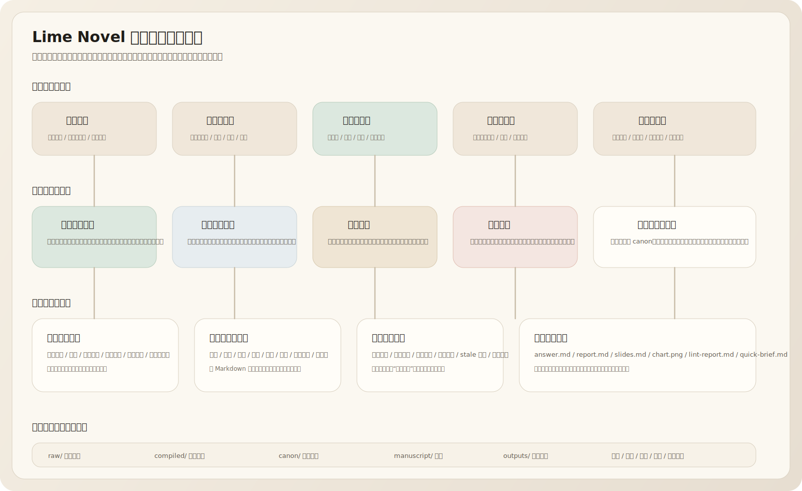
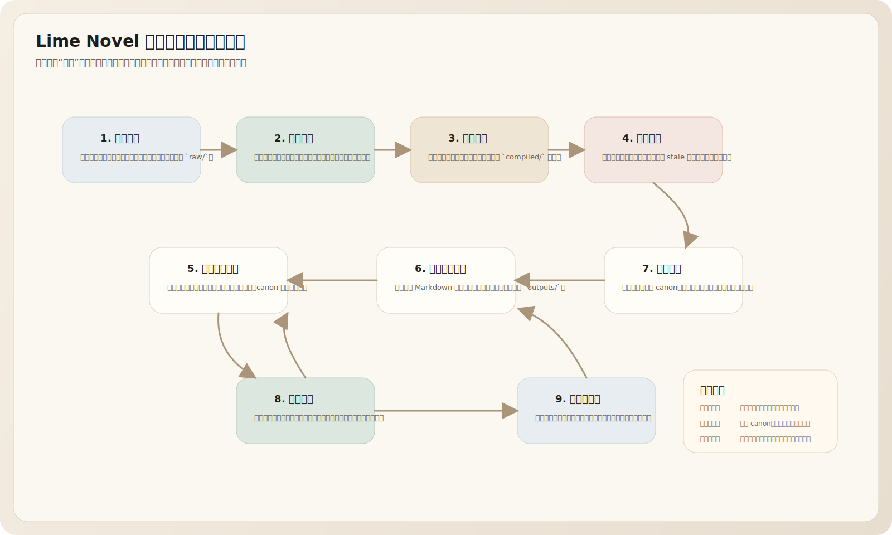
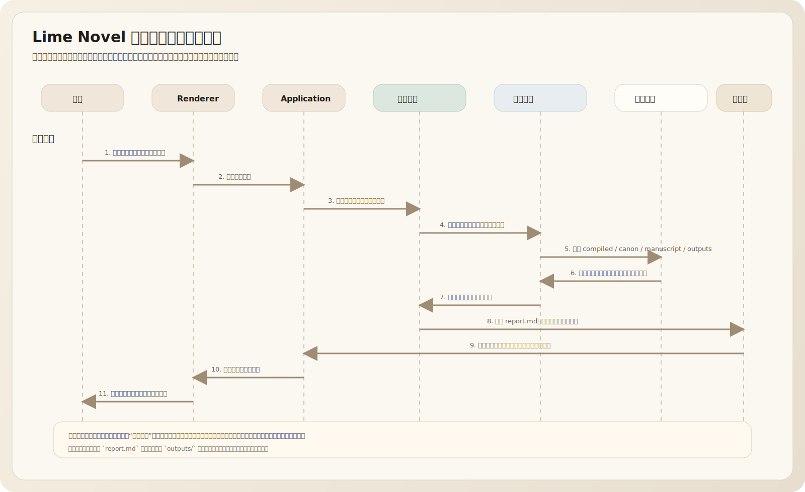
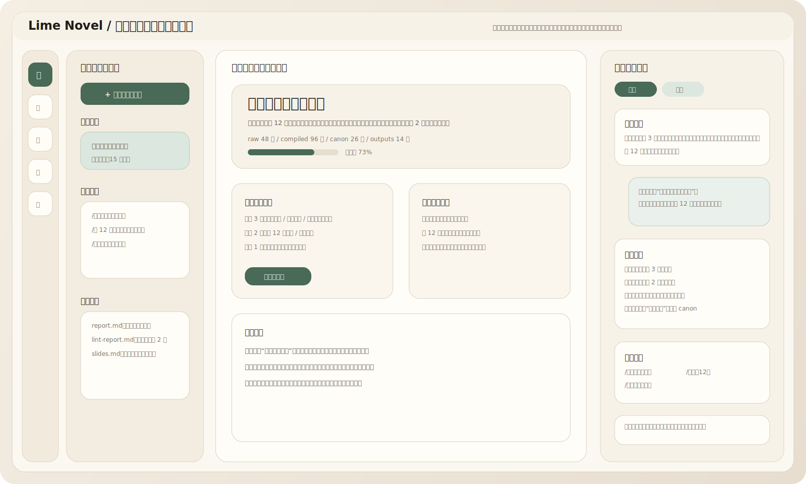
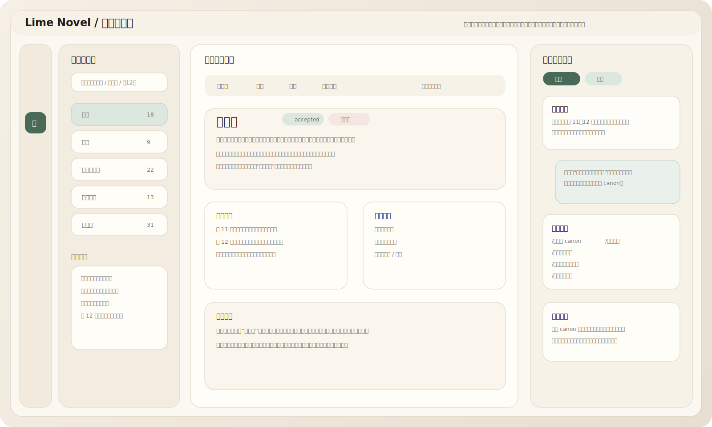
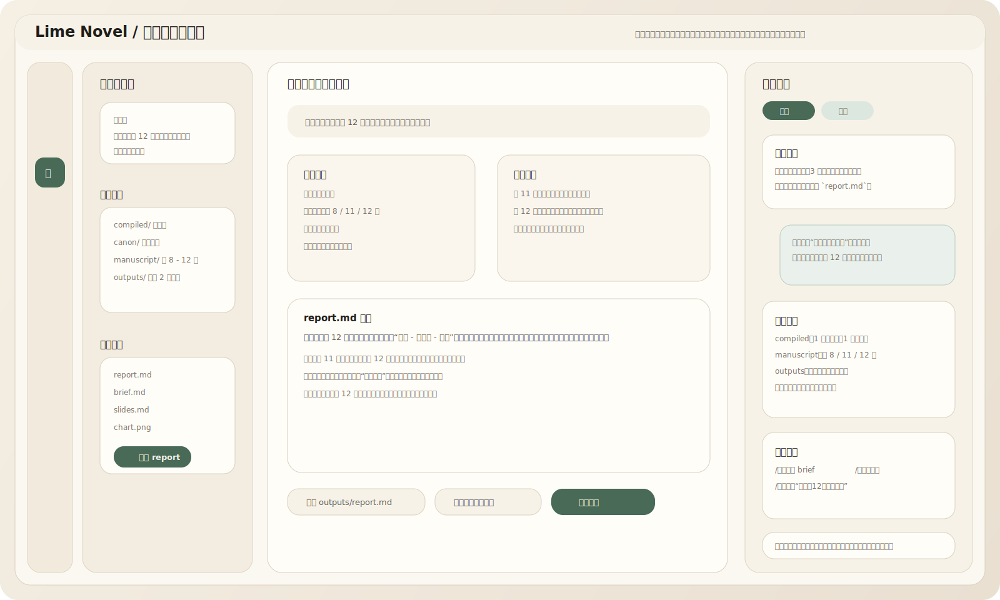

# Lime Novel 小说知识库与知识编译层设计方案

> 版本：0.1
> 更新：2026-04-03
> 对应文档：`lime-novel-electron-product-design.md`、`lime-novel-ui-design.md`
> 用途：定义 `Lime Novel` 的本地优先小说知识库、知识编译闭环与知识工作面
> 状态：产品专题总纲

---

## 一、结论

`Lime Novel` 不应该只把“设定卡、章节摘要、搜索结果”视为代理运行时的附属产物。

对于长篇小说来说，更合理的产品判断是：

**把原始素材、正文、设定和代理输出，持续编译为一层可检索、可追问、可巡检、可回写的项目知识层。**

这层能力不是传统意义上的“个人 wiki”，也不是通用笔记工具，而是小说项目的长期记忆系统。

它的核心职责有四个：

- 接住项目里的所有原始素材与中间产物
- 把素材持续编译成结构化知识页与证据索引
- 在写作、修订、问答时为代理提供可依赖的长期上下文
- 把新的问答结果、巡检结果和人工确认结果再回存到项目

一句话说清楚：

**Lime Novel 的目标不只是“帮你写下一段”，而是“让一部小说在本地持续积累自己的长期记忆，并在这个记忆上继续写下去”。**

## 二、为什么小说产品需要知识库层

### 2.1 长篇小说天然不是单轮生成问题

长篇写作有四个结构性特征：

- 人物状态持续变化
- 世界规则与道具关系会跨章延续
- 伏笔、线索与信息差需要长期维护
- 写作、修订、导出之间会反复回流

如果系统只靠“当前对话 + 当前章节上下文”工作，随着项目变大，一定会出现：

- 角色状态失忆
- 同一设定被重复表述
- 时间线前后打架
- 代理每次都要重新读很多材料
- 作者的问题得不到可累计的答案

### 2.2 小说知识库和通用研究 wiki 不一样

通用研究库强调资料汇总和多主题检索。

小说知识库更强调：

- **连续性**
  人物、地点、规则、事件必须前后一致
- **证据性**
  每个判断最好能回溯到章节、设定卡、原始资料
- **增量性**
  每写完一章，知识层都应该被持续更新
- **回写性**
  问答和巡检不是终点，它们要回流为新的知识资产

所以它更接近“知识编译层”，而不是单纯的“知识展示层”。

### 2.3 本地优先是这个方向的自然优势

这套能力非常适合本地优先产品：

- Markdown、图片和原始资料天然适合按文件组织
- 项目资产可备份、可迁移、可长期保存
- LLM 产物可以和正文、设定、导出物并列存档
- 代理不需要把长期项目事实托管给远端服务
- 即使模型、索引或缓存重建，项目事实仍然完整存在

这意味着 `Lime Novel` 可以把“项目目录”本身做成长期记忆容器，而不是把重要信息散落在会话历史里。

## 三、产品定位与边界

### 3.1 它是什么

`Lime Novel` 的小说知识库是一个：

- 面向长篇项目的本地知识编译层
- 服务写作、设定、修订和问答的长期记忆系统
- 以项目目录为载体，以 Markdown 和本地资产为第一事实源的工作面
- 由代理持续维护，但允许作者在关键节点进行确认和裁决的知识系统

### 3.2 它不是什么

它不是：

- 一个通用第二大脑产品
- 一个以聊天记录替代结构化知识的问答器
- 一个独立于小说项目之外的 wiki App
- 一个只会展示卡片、不会反哺写作的静态百科
- 一个一上来就依赖复杂 RAG、数据库和训练流水线的重系统

### 3.3 它与现有资产的边界

- `manuscript`
  正文仍然是作品本体，是最重要的工作对象
- `canon`
  已确认事实层，面向稳定设定与正式项目资产
- `knowledge base`
  工作知识层，允许存在候选事实、冲突标记、问答产物和巡检报告
- `outputs`
  一次次问答、分析、导出和汇报的结果目录，可再次被系统读取

换句话说：

- **正文是作品本身**
- **canon 是正式设定**
- **知识库是持续编译出来的项目长期记忆**

## 四、系统架构总览

下面这张图给出这套能力在 `Lime Novel` 里的整体位置：



### 4.1 关键分层

可以把这个系统理解为五层：

1. 作者工作层
   - 首页、写作、知识工作面、修订、发布
2. 代理编排层
   - 项目总控代理、知识编译代理、查询代理、巡检代理
3. 知识编译层
   - 原始资料清单、知识页、证据索引、冲突标记、候选事实、查询产物
4. 存储与执行层
   - 文件读写、检索、摘要、引用、导出、索引
5. 项目资产层
   - `raw / compiled / canon / manuscript / outputs`

### 4.2 核心目录判断

建议把项目目录统一成下面五类资产：

```text
raw/
  captures/
  research/
  images/
  notes/

compiled/
  entities/
  chapters/
  timelines/
  themes/
  queries/
  reports/

canon/
  characters/
  locations/
  rules/
  items/
  timeline/

manuscript/
  chapters/

outputs/
  answers/
  briefs/
  slides/
  charts/
```

这里最关键的判断是：

- `raw` 接住原始输入
- `compiled` 承接机器维护的工作知识层
- `canon` 承接被确认后的稳定事实
- `outputs` 承接用户问题的可复用答案

### 4.3 知识页最小协议

为了让代理稳定增量维护知识页，建议每个 `compiled` 页面至少带下面这些字段：

```yaml
id: kb-character-lin-qingyuan
type: character
title: 林清远
status: candidate
sources:
  - manuscript/chapters/012-before-the-lock-turns.md
related:
  - kb-location-clocktower
  - kb-item-key
updatedAt: 2026-04-03T15:10:00+08:00
```

正文结构建议统一为：

- 简述
- 当前可信事实
- 证据来源
- 与其他页面的关系
- 未决问题
- 反向链接

这不是为了做重 schema，而是为了让 LLM 在项目变大后仍然能稳定维护。

## 五、核心工作流

这套能力的本质不是“建一个目录”，而是形成闭环：



### 5.1 导入素材

输入来源包括：

- 正文章节
- 外部网页转存
- 图片和参考资料
- 用户随手记录的设定草稿
- 代理产生的中间分析结果

导入后系统要先做的不是立刻“理解一切”，而是：

- 记录来源
- 生成基础索引
- 生成可追踪的文档清单
- 挂上所属项目与时间信息

### 5.2 编译知识

知识编译代理负责：

- 提取人物、地点、规则、道具、事件、主题
- 为每个对象生成工作知识页
- 追加摘要、证据块和反向链接
- 标记冲突、重复和证据不足项
- 只对需要正式确认的内容发起审批

这里的核心原则是：

**优先增量更新，不优先全量重写。**

### 5.3 针对项目提问

用户提出问题后，系统不应该只返回一段临时文本。

更合理的做法是：

- 先命中相关知识页和证据
- 再组织推理和归纳
- 最终产出一个 Markdown 报告、简报、幻灯片或图表
- 让这个产物默认进入 `outputs/`

这样一来，用户每次提问都会让项目知识层继续生长。

### 5.4 运行健康检查

巡检代理需要定期给项目做“知识体检”：

- 找到重复人物页或重复概念
- 找到证据缺失的结论
- 找到章节新增但未同步的人物状态变化
- 找到时间线冲突
- 找到未归档的高价值问答结果

巡检的价值不只是“报错”，而是帮作者发现下一步值得问、值得补、值得修的地方。

### 5.5 回写项目

并不是所有结果都应该自动写回。

默认应区分三类动作：

- 自动写回
  - 更新索引、摘要、反向链接、查询产物目录
- 建议写回
  - 候选知识页、候选设定卡、巡检报告
- 审批后写回
  - 升级为 `canon`
  - 批量修复冲突
  - 对正文或正式设定做覆盖性修改

## 六、一次复杂问答的关键时序

下面这张图用“某角色当前知道什么”这个典型问题说明系统如何工作：



### 6.1 时序判断

这条链路里最关键的不是“模型回答了什么”，而是：

- 问题会先被收敛到项目范围内
- 查询代理会先检索 `compiled / canon / manuscript / outputs`
- 重要证据会被显式带进结果，而不是只被隐式消费
- 最终产物会落成文件，而不是只停留在消息气泡里

这会显著提升：

- 结果可复查性
- 问答可沉淀性
- 后续问题的复用效率

## 七、代理与工具设计

### 7.1 代理角色

建议把知识能力拆成四类代理，而不是挤进一个万能代理：

- `项目总控代理`
  负责恢复现场、判断当前应该跑编译、巡检还是问答
- `知识编译代理`
  负责从原始素材和正文中提取、合并、更新知识页
- `查询代理`
  负责围绕具体问题检索、阅读、归纳并生成输出
- `巡检代理`
  负责一致性检查、缺口发现、候选问题生成和修复建议

### 7.2 工具边界

工具层优先承接确定性动作：

- 文件读取与写入
- 项目索引与路径发现
- 关键词搜索与对象聚合
- 证据摘录与引用拼装
- 输出文件生成
- 差异比较与审批前预览

模型应该负责判断、归纳和撰写，不应该替代确定性文件操作。

### 7.3 审批原则

以下动作必须进入显式审批：

- 把 `compiled` 内容升级为 `canon`
- 批量合并或删除知识页
- 覆盖已有正文或正式设定
- 用外部检索结果改写现有项目事实

这能保证知识库是“代理主维护”，但不是“代理无约束接管”。

## 八、UI 设计方向

这套能力需要进入正式工作壳，而不是藏在零散弹窗和脚本命令里。

### 8.1 首页：让作者先看到知识健康度

首页需要增加知识相关的恢复信息：

- 当前项目知识健康度
- 最近编译结果
- 最近生成的查询产物
- 快速提问入口

对应草图如下：



首页的作用不是让用户“管理资料”，而是让作者知道：

- 当前项目的长期记忆是否健康
- 现在最值得继续追问什么
- 最近后台知识处理产出了什么

### 8.2 知识工作面：知识页、证据、回写在同一屏

知识工作面不应该长成一堆散乱的卡片页。

更合理的形态是：

- 左侧：范围、筛选和对象目录
- 中央：知识页、证据、关系和最近变更
- 右侧：知识编译代理或巡检代理的建议与审批

对应草图如下：



这里的关键判断是：

- 知识页必须和证据同屏
- `candidate / accepted / conflicted / stale` 必须一眼可见
- 用户可以从知识页直接追问，也可以直接发起写回

### 8.3 查询工作面：答案默认是文件，而不是气泡

针对复杂问题，前台需要突出两件事：

- 代理读了哪些材料
- 最终要生成什么格式的文件

对应草图如下：



这意味着查询工作面的中心不是聊天气泡，而是：

- 问题输入
- 命中资料与证据
- 输出格式选择
- 结果文件预览
- 是否写回项目的动作

### 8.4 UI 与现有工作面的关系

这套能力不是要把产品做成“知识管理器优先”，而是：

- 首页负责恢复现场与知识健康度
- 写作工作面负责消费知识层
- 知识工作面负责编辑、核查与提问
- 修订工作面负责处理巡检发现的问题
- 发布工作面负责消费知识层里的摘要与说明产物

所以知识库不是替代现有工作面，而是让所有工作面共享一层长期记忆。

## 九、MVP 范围

第一阶段建议只做下面这些能力：

- 本地目录中的 `raw / compiled / canon / manuscript / outputs`
- 知识页的最小协议
- 编译知识页
- 对项目提问并生成 Markdown 产物
- 健康检查报告
- 少量必要的审批点

第一阶段明确不做：

- 复杂远程协作
- 重量级数据库优先方案
- 先上 embedding-first 的大而全 RAG 平台
- 大规模自动外部抓取
- 直接把知识库做成独立产品线

这个阶段的目标不是“功能看起来很全”，而是让小说项目先形成持续积累的知识闭环。

## 十、阶段路线图

### Phase 1：知识闭环成立

- 本地素材导入
- 增量知识编译
- 问答生成 Markdown 报告
- 健康检查与候选卡回写

### Phase 2：工作面成熟

- 图谱导航
- 更完整的反向链接和关系展示
- 批量审批与批量修复
- 幻灯片、图表等更多输出格式

### Phase 3：长期记忆增强

- 更深的项目压缩策略
- 更稳定的项目级摘要和阶段性快照
- 面向训练或合成数据的资产导出
- 让模型“更像知道这部作品”，但不破坏本地事实源

## 十一、最终判断

`Lime Novel` 如果只停留在“正文编辑器 + 设定卡 + 对话侧栏”，长期上限会比较明确。

一旦把小说知识库做成正式能力，系统就会出现新的质变：

- 问答会沉淀
- 修订会更有依据
- 角色与时间线会更稳定
- 代理不再反复从零理解项目
- 作者的每次探索都会让项目变得更聪明一点

所以这件事最适合的产品定义不是“补一个 wiki 功能”，而是：

**给 `Lime Novel` 增加一层本地优先、代理主维护、持续可回写的小说知识编译层。**
