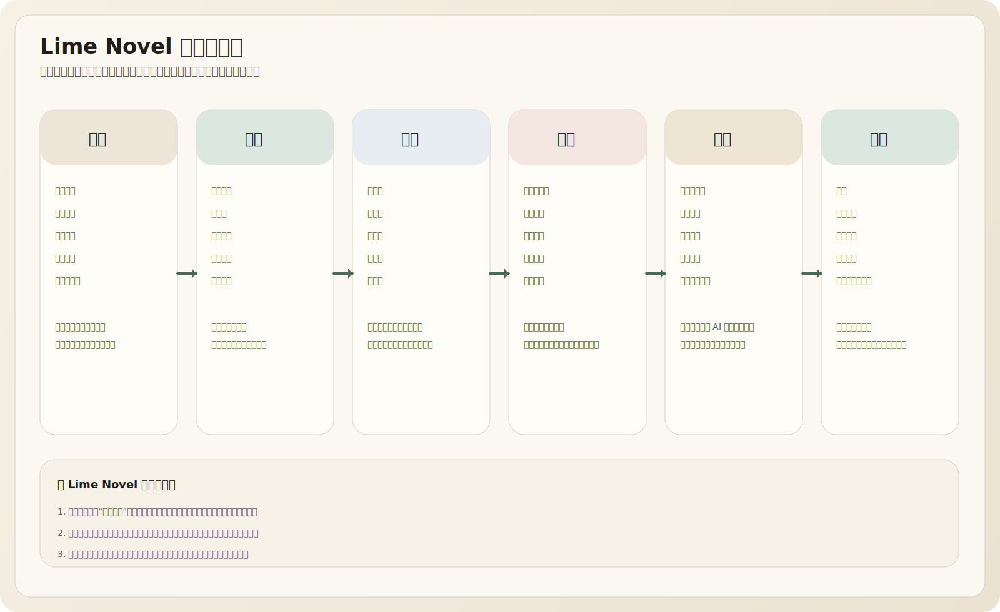
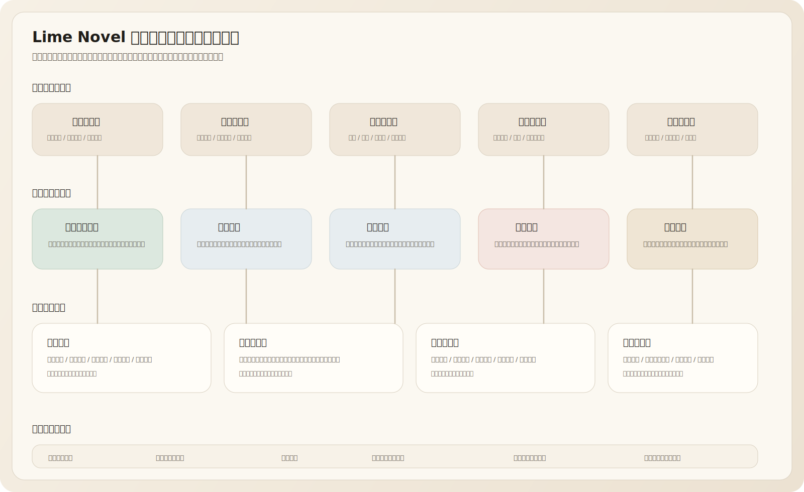
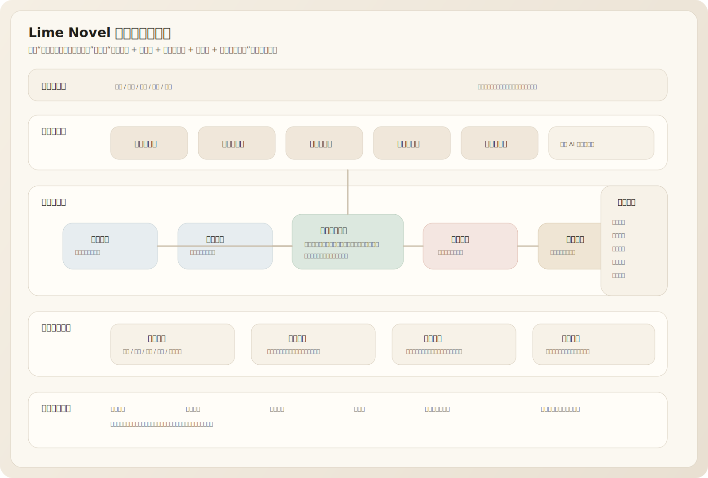
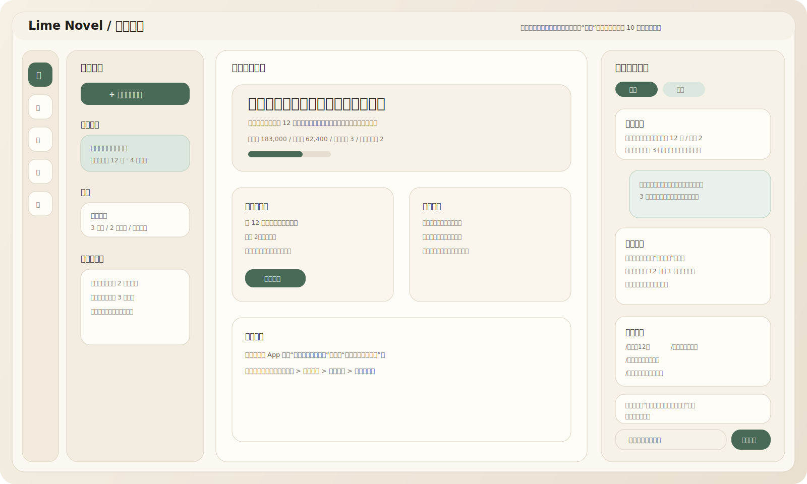
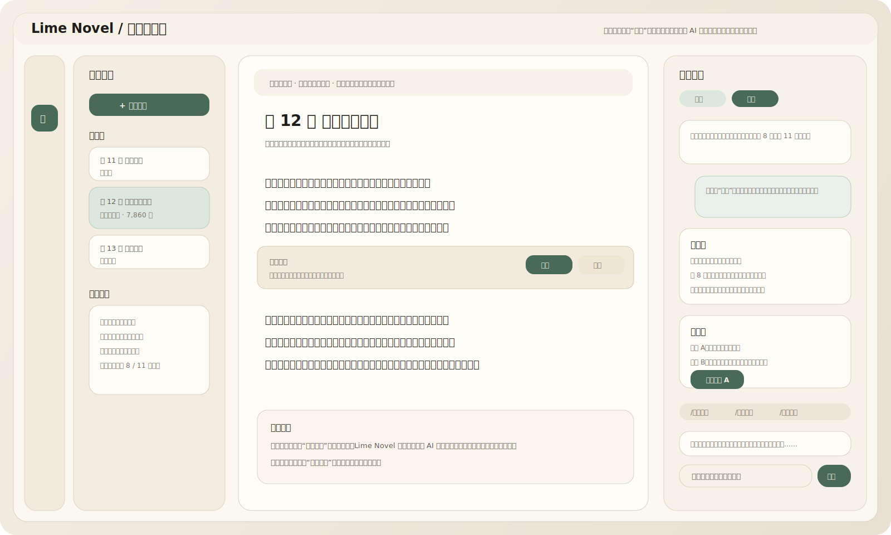
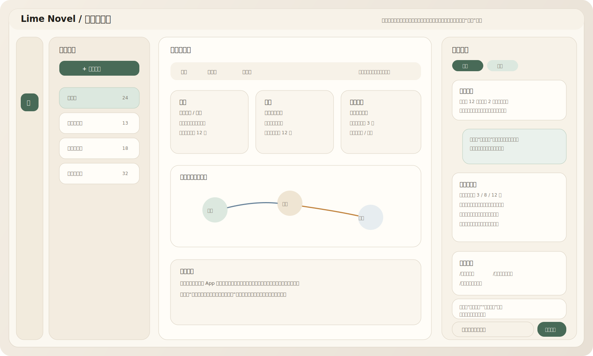
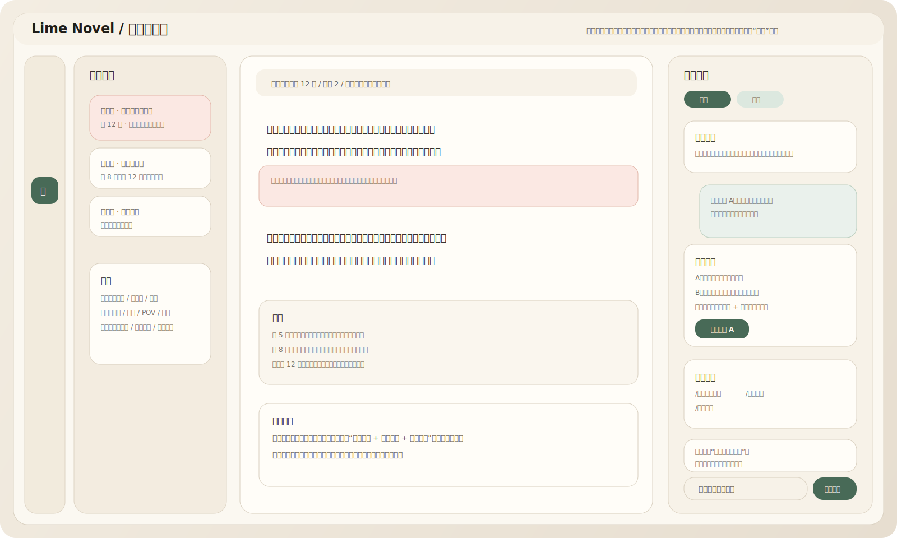
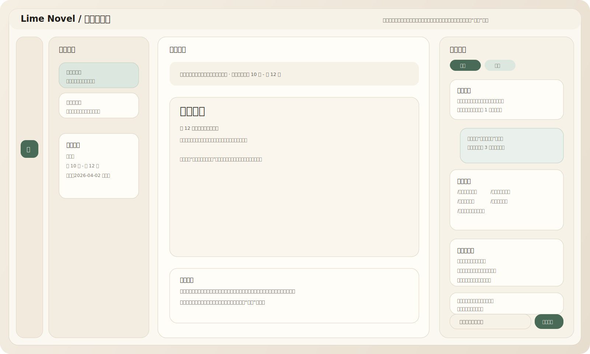

# Lime Novel UI 设计方案

> 版本：0.3
> 更新：2026-04-02
> 对应文档：`lime-novel-electron-product-design.md`
> 用途：定义 `Lime Novel` 以“左侧小说工作面 + 右侧 AI 代理协作栏”为核心的桌面 UI

---

## 一、设计结论

`Lime Novel` 的 UI 不应该继续长成：

- 一个放大版聊天页
- 五个彼此割裂的大页面
- 一个把代理、技能、连接器直接暴露给作者的系统控制台
- 一个看起来像 Lime 主 App“通用创作壳”的分支版本

新的 UI 应该统一为一个稳定工作壳：

**左侧小说工作面 + 右侧 AI 代理协作栏**

其中：

- 左侧承接作品本体与当前工作对象
- 右侧承接当前代理、子代理、任务、证据、提议和审批
- 顶部负责项目与状态
- 底部负责轻量运行反馈

这不是纯视觉选择，而是底层代理系统在前台的自然呈现方式。

## 二、为什么 UI 要这样长

参考 `claudecode` 的结构，一个成熟代理产品前台至少要能承接五类东西：

- 当前主代理在做什么
- 后台子代理完成了什么
- 为什么给出这个判断
- 哪一步需要用户确认
- 哪些结果已经写回正文、卡片或任务队列

如果把这些都塞进传统顶部导航或弹窗里，体验会很碎。

所以 `Lime Novel` 需要两个稳定区域。

### 2.1 左侧小说工作面

负责承接“作品对象”：

- 项目首页
- 章节正文
- 设定卡与关系图
- 修订差异与问题定位
- 导出预览与发布资产

左侧永远是作品本身，不是 AI 输出本身。

### 2.2 右侧 AI 代理协作栏

负责承接“代理过程”：

- 当前代理说明
- 连续对话
- 任务进度
- 证据片段
- 可应用提议
- 审批条
- 风险提示

右栏必须是对话流，但不是空聊天。
它是一条带结构化卡片的上下文对话流。

## 三、统一窗口骨架

### 3.1 默认布局

- 顶部项目栏：`48px`
- 左侧导航轨：`72px`
- 工作结构列：`260px`
- 主工作面：最小 `760px`
- 右侧 AI 栏：`380px`
- 底部状态条：`28px`

### 3.2 各区职责

#### 顶部项目栏

负责：

- 当前项目或系列切换
- 搜索
- 专注模式
- 同步与模型状态
- 导出入口

#### 左侧导航轨

只放稳定一级对象：

- 首页
- 写作
- 设定
- 修订
- 发布

不放工程页，不放技能管理页，不放代理调试页。

#### 工作结构列

根据当前工作面切换内容，例如：

- 写作时显示章节树与场景列表
- 设定时显示卡片分类
- 修订时显示问题队列
- 发布时显示导出预设和资产列表

#### 主工作面

永远承接当前作品对象本身。

#### 右侧 AI 栏

右栏不是单一建议面板，也不是单一聊天面板，而是同一套代理状态的两种视图：

- `建议`
- `对话`

### 3.3 右栏内部结构

建议固定为四段：

1. 当前代理头部
2. 视图切换条
3. 主内容区
4. 底部操作区

默认规则：

- 写作工作面默认先打开 `建议`
- 点击 `对话` 后切到完整消息流
- 两个视图共享同一套任务、证据、提议和审批状态

主内容区里的结构化结果卡常见类型包括：

- `任务卡`
- `证据卡`
- `提议块`
- `差异卡`
- `审批条`
- `风险卡`

## 四、小说专用工作面体系

`Lime Novel` 不是五个割裂的大页面，而是同一套工作壳下的五种小说专用工作面。

### 4.1 首页工作面

首页的目标不是展示所有功能，而是让作者最快回到作品。

它应该重点展示：

- 最近项目
- 系列与卷册
- 恢复写作入口
- 最近代理结果
- 项目健康度

右栏此时由“项目总控代理”接管，负责：

- 恢复现场
- 推荐下一步
- 汇总最近一次后台结果
- 支持一键切到对话继续追问

这张图展示默认 `建议` 视图，强调首页先帮作者恢复现场，而不是立刻进入长对话。

### 4.2 写作工作面

写作工作面是整个产品的主战场。

左侧需要稳定承接：

- 章节树
- 场景列表
- 当前章节目标
- 本章状态

中央主工作面需要稳定承接：

- 正文编辑器
- 选区操作
- 行内提议
- 提议接受或拒绝
- 差异对照

右栏由“章节代理”主导，但也会混入：

- 设定代理的提醒
- 修订代理的即时预警
- 子代理任务结果

这张图会直接展示 `对话` 视图，以明确输入框、消息流和结构化卡片如何共存。

### 4.3 设定工作面

设定工作面的目标不是做厚重后台，而是做“项目长期记忆的可操作前台”。

左侧负责：

- 分类
- 筛选
- 冲突标签

中央负责：

- 卡片
- 关系
- 时间线
- 引用章节

右栏由“设定代理”主导，负责：

- 提取候选卡
- 同步人物状态
- 标记冲突
- 展示证据来源
- 需要时切到对话继续追问卡片边界与抽取范围

这张图展示默认 `建议` 视图，强调“先看候选卡与证据，再决定是否切到对话深挖”。

### 4.4 修订工作面

修订工作面要把“建议”转成“可处理的问题”。

左侧负责问题队列。
中央负责问题定位、原文上下文与差异对照。
右栏由“修订代理”主导，负责：

- 给出多方案修订
- 展示证据
- 标记影响范围
- 提供应用、稍后、忽略等动作
- 允许切到对话追问“为什么是高优先”“再给我更克制的一版”

这张图展示默认 `建议` 视图，强调修订先围绕问题与方案做决策，再进入对话追问细节。

### 4.5 发布工作面

发布不是一级大导航页，而是同一套壳里的结果工作面。

中央负责：

- 导出预览
- 资产检查
- 元数据编辑
- 章节拆分

右栏由“发布代理”主导，负责：

- 生成导出预设
- 平台化提示
- 校验结果
- 最终确认
- 允许切到对话补写简介、追问平台差异和版本比较

这张图展示默认 `建议` 视图，强调发布前先完成预检与动作确认，再切到对话补齐长文本内容。

## 五、右侧 AI 代理协作栏设计

这是这次 UI 最关键的调整。

### 5.1 右栏必须是“双态协作栏”

右栏统一提供两种视图：

- `建议`
- `对话`

它们不是两套系统，而是同一套代理上下文的两种前台呈现。

默认规则：

- 默认打开 `建议`
- 顶部固定双标签切换
- 所有后台结果同时写入两种视图

### 5.2 建议视图

建议视图负责高密度展示“当前最该处理什么”。

核心内容：

- 当前代理摘要
- 任务结果
- 风险与证据
- 可应用提议
- 快捷动作

这个视图适合作者在不中断正文的情况下快速浏览和决策。

### 5.3 对话视图

对话视图负责连续协作。

它必须包含：

- 连续消息流
- 混排的结构化卡片
- 常驻输入框
- 快捷命令胶囊

这里不是纯聊天气泡，而是“对话流 + 结果卡”混排。

这样作者能同时看到：

- 代理刚才读了什么
- 为什么给出这个建议
- 当前有哪几个后台任务
- 哪个结果已经可以应用

### 5.4 右栏消息类型

建议统一五种消息形态。

#### 说明消息

代理解释当前状态，例如：

- 已读取当前章目标
- 已命中某角色卡
- 已完成一次后台检查

#### 证据消息

显示判断依据，例如：

- 命中的章节片段
- 命中的设定卡
- 外部资料来源

#### 提议消息

显示可应用结果，例如：

- 续写一版
- 改写一版
- 补一条卡片
- 生成一个发布简介

#### 任务消息

显示后台代理或子代理状态，例如：

- 设定提取完成
- 节奏检查进行中
- 导出预检完成

#### 审批消息

显示需要确认的动作，例如：

- 应用 3 处正文改写
- 批量更新人物卡
- 覆盖导出文件

### 5.5 双态共享状态

`建议` 和 `对话` 必须共享下面这些状态：

- 当前主代理
- 当前子代理任务
- 当前上下文命中
- 当前证据池
- 当前提议候选
- 当前审批状态

不允许出现：

- 建议视图已经有结果，但对话视图失忆
- 对话里刚追问出新方案，但建议视图看不到

### 5.6 右栏头部信息

头部固定显示：

- 当前主代理名称
- 当前工作面
- 当前激活的子代理
- 当前记忆来源
- 当前风险级别

### 5.7 输入区

输入区只在 `对话` 视图中常驻显示。

它还应支持：

- 斜杠命令
- 针对选区提问
- 引用卡片
- 插入章节或设定上下文
- 直接触发动作，例如“补强悬念”“检查视角”

建议视图的底部则保留：

- 快捷动作
- 切到对话继续提问

## 六、共通组件

### 6.1 代理头卡

显示：

- 主代理
- 子代理
- 当前任务
- 最近完成动作

### 6.2 任务卡

显示：

- 任务名
- 状态
- 影响范围
- 可跳转位置

### 6.3 证据卡

显示：

- 来源章节、卡片或外部资料
- 命中原因
- 摘要片段

### 6.4 提议块

显示：

- 建议内容
- 应用范围
- 接受、拒绝、再来一版

### 6.5 差异卡

显示：

- 原文
- 新版
- 关键改动说明

### 6.6 记忆胶囊

显示当前轮次被引用的：

- 角色
- 地点
- 规则
- 时间线
- 章节摘要

### 6.7 审批条

对于高风险动作，固定放在对话输入区上方，或放在建议视图底部动作区，避免被消息流淹没。

## 七、视觉方向

### 7.1 气质关键词

- 纸感
- 工坊感
- 沉静
- 长读友好
- 轻系统感，重作品感

### 7.2 色彩

- 主背景：`#F3EEE3`
- 面板底色：`#FBF8F1`
- 正文纸面：`#FFFDF8`
- 边框：`#D9D0C0`
- 深绿：`#486A57`
- 琥珀：`#C1843F`
- 红棕：`#A85B4C`
- 蓝灰：`#68839A`

### 7.3 字体

- UI：`PingFang SC`、`Microsoft YaHei UI`
- 正文：`Source Han Serif SC`、`Songti SC`

## 八、交互规则

### 8.1 左侧工作面永远优先

任何时刻都不能让右栏 AI 完全盖过主工作面。

### 8.2 AI 结果默认先提议，再应用

不允许无确认直接覆盖大段正文。

### 8.3 后台代理不能抢焦点

后台结果只以任务卡、风险卡、已完成提示回流。

### 8.4 高频动作必须双入口

每个高频动作都应同时支持：

- 右栏快速触发
- 选区或斜杠命令触发

### 8.5 证据必须可见

特别是修订、冲突、外部引用，必须能看到来源。

## 九、模式切换

同一套壳内只保留少量模式，不为每个场景再做一套新壳。

### 9.1 标准模式

四区完整展开，适合日常写作与检查。

### 9.2 专注模式

隐藏结构列与右栏，只保留正文和极简状态。

### 9.3 结构模式

左侧结构列展开，适合排章节和调节奏。

### 9.4 修订模式

中央切差异工作面，右栏聚焦证据与修订方案。

## 十、桌面端适配建议

- `1440px+`：完整四区布局
- `1200px - 1439px`：收窄结构列
- `1000px - 1199px`：右栏默认折叠为抽屉
- 小屏不建议作为主写作设备，但需要支持查看与轻量修改

## 十一、落地顺序

### 第一阶段

- 统一工作壳
- 首页工作面
- 写作工作面
- 右侧 AI 双态协作栏
- 章节代理基础 UI

### 第二阶段

- 设定工作面
- 修订工作面
- 证据卡、提议块、差异卡

### 第三阶段

- 发布工作面
- 审批条
- 更强任务与子代理表现

## 十二、最终判断

`Lime Novel` 的 UI 不该再继续优化“聊天页怎么更复杂”，而应该明确变成：

**左侧是小说专用工作面，右侧是代理对话协作栏。**

作者始终看着作品本身，代理始终在旁边解释、执行、回写、提醒。
这才是一个“以 AI 代理为底层”的小说系统在前台该有的样子。
